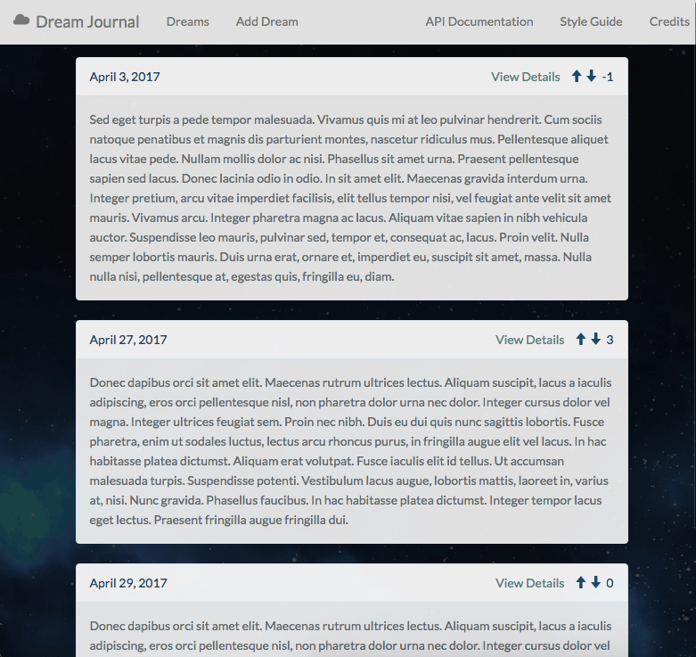

## Dream Journal

A public, anonymous dream journal that lets you post your dreams, view others' dreams, and share and vote on the most interesting ones.

If you like an entry, you can upvote it, and it will move closer to the top. Similarly, if you thought an entry was boring, you can downvote it, and it will move closer to the bottom.

This web application was built with Laravel, PHP, Vue.js, and Bootstrap.

### Screenshot

### Setup

Clone this repository.

In MAMP, set the project root to the 'public' folder of the project.

The Apache port should be 8888 and the MySQL port 8889.
The database the tables are stored in is named 'app'.
Ensure that you already have or have created a database named 'app'.

Run `npm install` to install the node dependencies.

Run `php artisan:migrate` to make the tables for the API.

In the terminal, enter `npm run dev`. This starts the Vueapplication.

Point your browser to [http://localhost:8888](http://localhost:8888). This is where the application lives.

You can use any code library or GUI that allows you to make POST requests to interact with the API.