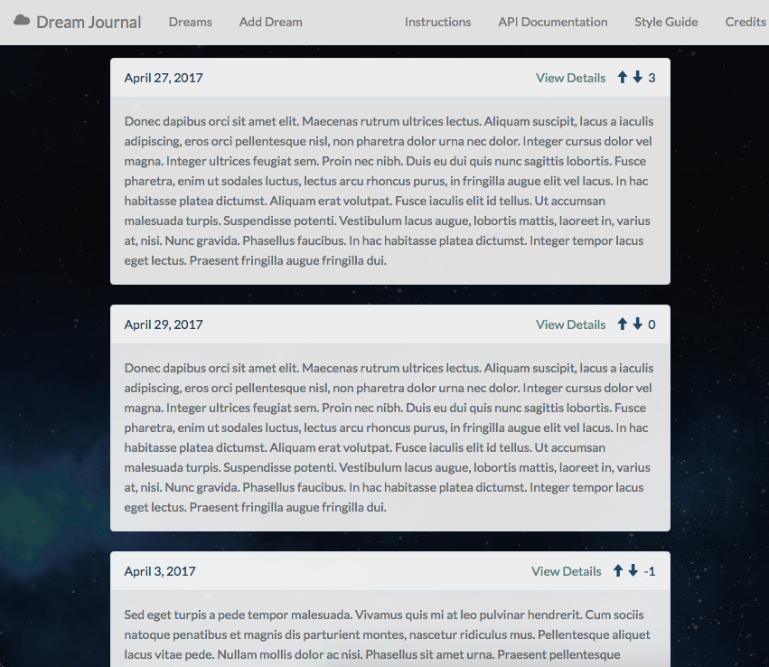

## Dream Journal

A public, anonymous dream journal that lets you post your dreams, view others' dreams, and share and vote on the most interesting ones.

If you like an entry, you can upvote it, and it will move closer to the top. Similarly, if you thought an entry was boring, you can downvote it, and it will move closer to the bottom.

This web application was built with Laravel, PHP, Vue.js, and Bootstrap.

You can view the API documentation [here](https://audreysharp.gitbooks.io/dream-journal/content/).

### Screenshot

### Setup

Clone this repository.

In MAMP > Preferences > Web Server, set the project root to the 'public' folder of the directory.

The Apache port should be 8888 and the MySQL port 8889.
The database the tables are stored in is named 'app'.
Ensure that you already have or have created a database named 'app'.

Run `npm install` to install the node dependencies.

Run `php artisan:migrate` to make the 'entries' table for the API.

In the terminal, enter `npm run dev`. This builds and starts the Vue application.

Point your browser to [http://localhost:8888](http://localhost:8888). This is where the application lives.

You can use any code library or GUI that allows you to make POST requests to interact with the API.

___

### Technical Details

Laravel and PHP are used for the backend. Eloquent ORM is used for database handling. Vue.js was used for building the user interface. Bootstrap was the CSS framework used to style the user interface.

#### Vue Components
* AppAdd - Page that shows form to add an entry
* AppIndex - Index page that shows entries
* AppView - View page that allows you to view single entry, vote on an entry, and delete or update an entry
* Entry - Entry view shown on homepage (used in AppIndex.vue)
* EntryForm - Form where you add entry (used in AppAdd.vue)
* EntryView - Shows single entry in /view/{id} (used in AppView.vue)
* Spinner - Spinning loader
* VoteArrows - Handles upvoting and downvoting (used in Entry.vue and EntryView.vue)